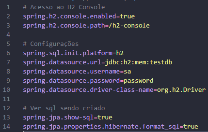
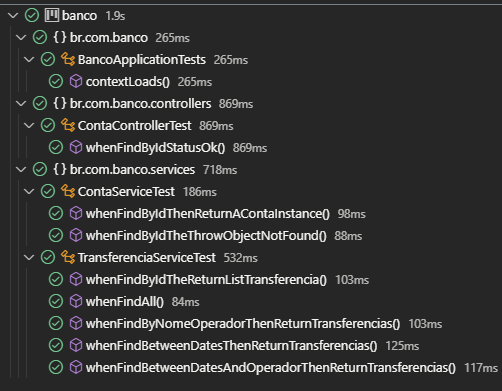
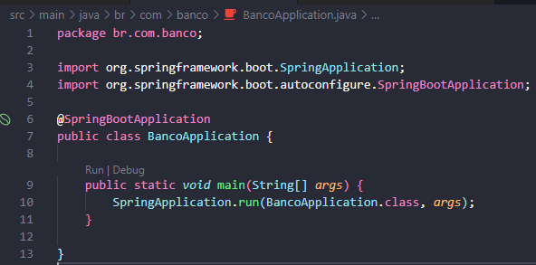

# Api Conta Bancária

## Descrição do Projeto

Utilizando boas práticas de programção e cobertura de testes automatizados projeto consiste na criação de uma api para fornecer dados de transferência bancária promovido pela empresa [Supera Inovação em Tecnologia](https://www.linkedin.com/company/supera-tecnologia/).

Para realização dos testes são utilizados o [JUnit5](https://junit.org/junit5/) e o [Mockito](https://site.mockito.org/).

## End-Points do Projeto

Seguem exemplos de endpoints para utilização da api.

- [GET] Dados de transferência de acordo com o **número** da conta bacária: {url}/transferencia?contaId=1
- [GET] Todos os dados de transferência: {url}//transferencia/all
- [GET] Transferência por **período de tempo**: {url}/transferencia/datas?first=2019-01-01 00:00:00&last=2019-05-04 00:00:00
- [GET] Transferência por **operador de transação**: {url}/transferencia/{nomeOperador}
- [GET] Transferência por **todos os filtros**: /transferencia/datas-operador?nome=Beltrano&first=2020-06-08 00:00:00&last=2021-04-01 00:00:00

## Descrição da Api
### Executar Api localmente:
- Para clonar o projeto: git clone https://github.com/TaylanTorres09/api-banco.git
- Para Executar o projeto precisasse:
    - Java [JDK](https://www.oracle.com/br/java/technologies/javase/jdk11-archive-downloads.html). Este projeto está usando a versão 11.
    - Para perfil de Teste, Banco [H2](https://www.h2database.com/html/main.html) utilizado em memória, coloquei neste pois é um banco de fácil configuração e utilização.

- Extensões do [vscode](https://code.visualstudio.com/) utilizadas:
    - [Debugger for Java](https://marketplace.visualstudio.com/items?itemName=redhat.java)
    - [Spring Boot Extension Pack](https://marketplace.visualstudio.com/items?itemName=Pivotal.vscode-boot-dev-pack)

- Configuração do banco de dados de Teste, este é o perfil ativo do projeto.

- Para executar os teste da aplicação, você pode executar todos ou de um por um.

- Na pasta src/main, execute o arquivo BancoApplication.java

- Para testar a api você pode utilizar ferramentas de client como:
    - [Postman](https://www.postman.com/)
    - [Insomnia](https://insomnia.rest/download)
    - Extensão do VsCode [Thunder Client](https://marketplace.visualstudio.com/items?itemName=rangav.vscode-thunder-client)
    - Ou outra de sua preferência.

## Próximos Passos
- Implementar métodos de cadastro, atualização e anulação de contas.
- Fazer deploy.

## Autor
 